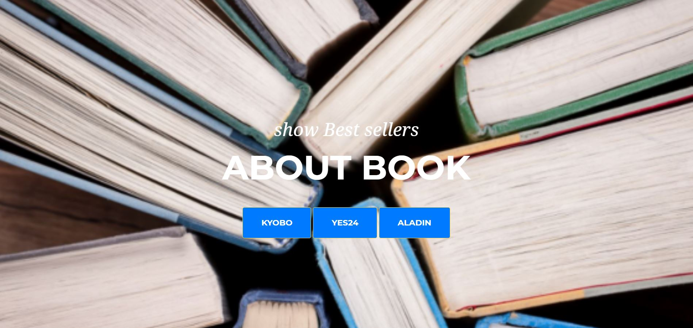
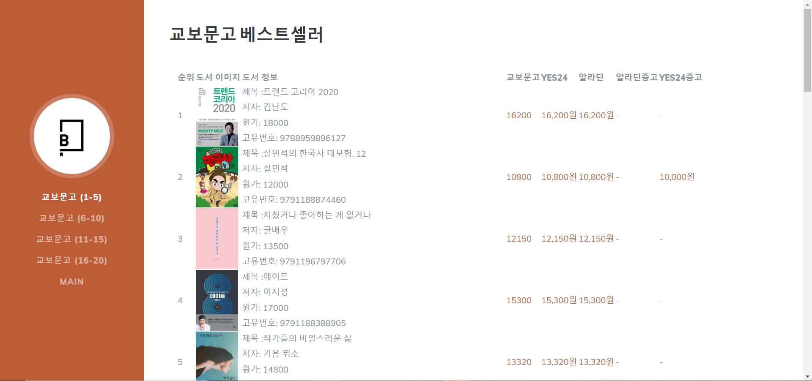

# "Booking - Show Bestseller"
클라우드 컴퓨팅 최종 프로젝트

1. 프로젝트 주제 설명
 - 교보문고, yes24, 알라딘 세 곳의 사이트에서 베스트셀러 top 20을 제공
 - 각 사이트의 베스트셀러별 교보문고, yes24, 알라딘, yes24중고, 알라딘중고의 가격 비교

2. 프로젝트 설명
 - Craling Program 제작
 - 온라인 서점 세 곳에서 하루 단위로 지속적으로 베스트셀러 top 20을 crawling
 - crawling data를 웹페이지에 적용

3. 프로젝트 환경
 - AWS 가상환경 활용
 - 필요환경 requirement.txt 참고
 - 배포 링크 : http://54.173.3.47:8000/
 
4. 사용법

 - 첫 페이지에서 서점이름을 누른다.
 
 
 - 해당 서점의 베스트셀러 top20을 보여준다.
 
 - 가격을 비교하고 원하는 사이트에 접속해 구매한다.
 
